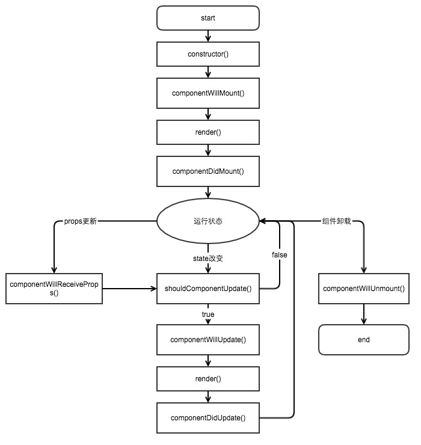

# react生命周期
本文是对react官网内容的`翻译`并加入了一些自己的`理解`包括一些简单的react`优化`方法。  

react的生命周期主要分为三个大的阶段，  
每个阶段又分若干个小方法。  
带有will前缀的方法指在事件发生前调用，  
而带有did前缀的方法指在事件发生后调用。  

具体流程图如下：

## 1. Mounting -- 装载
### 1.1 componentWillMount
在render方法前执行一次，  
不管state是否改变都只执行一次，  
在此方法中调用setState方法在render中将获取到state的更新变化，  
此方法可以在服务器端和客户端被调用。
### 1.2 componentDidMount
在render方法执行后执行一次，  
并且与componentWillMount方法一样只执行一次，  
不同的是此方法只能在客户端被调用。  
你可以在这个方法中访问基本DOM结构因为此时已渲染出真是DOM，
一般在此方法中向服务器请求数据。  
需要注意的是子组件的compontentDidMount方法会在父组件的之前调用。  
⚠️假设这样一个情景：  
子组件需要拿到父组件的一些state才能继续加载，  
而父组件的这些state需要向服务器发送请求才能拿到，  
上述加载顺序必定会引发子组件无法正常加载的情况，  
面对这种情况该如何解决？
## 2. Updating -- 更新
### 2.1 componentWillReceiveProps
当组件接收到新的props调用此方法，  
在初始渲染时不调用，  
可以在这个方法里更新state,  
以触发render方法重新渲染组件。
该方法可与条件判断语句一起使用来解决
>子组件的compontentDidMount方法会在父组件的之前调用

的问题。  

⚠️注意：在此函数中调用this.props获取的是老的props。

### 2.2 shouldComponentUpdate
当接收到新的props或state时在render前调用，  
对于初次渲染和forceUpdate不调用此方法，  
当该方法返回false跳过render方法和之后的componentWillUpdate和componentDidUpdate方法。  
当然该方法默认返回值为true。  
⚠️注意：当组件数量较大时可以使用该方法来进行性能的优化。

### 2.3 componentWillUpdate
该方法在render方法前被立即调用，  
并且对于初次渲染不调用此方法。  
⚠️注意：你不能在此方法中调用setState()方法，
若需要应在componentWillReceiveProps方法中。
### 2.4 componentDidUpdate
该方法在render方法后被立即调用，  
并且对于初次渲染不调用此方法，  
当组件更新时，这是操作DOM的好机会。
## 3. Unmounting -- 卸载
### 3.1 componentWillUnmount
在组件将从DOM被卸载时立即调用，  
主要用来执行一些必要的清理任务。  
例如清除setTimeout等函数，  
或者任意的在componentDidMount创建的DOM元素。
## 4. 优化方案
