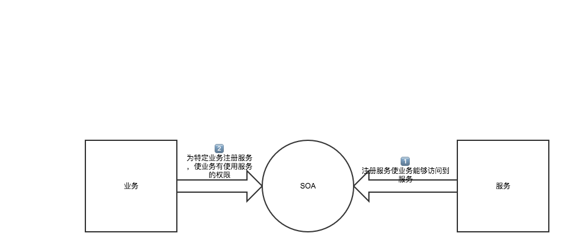

# 关于应用整体架构
来美团有差不多一周了，  
看了万虎前辈的一些wiki上的总结，  
除了前端方面的知识，  
对于项目的整体架构也有了一些入门的了解，  
如果说前端是微观的话，那么一个应用的整体架构我认为可以说是宏观了。

## 从Thrift开始
Thrift是来到美团后遇到的第一个新名词，  
Thrift是一种接口描述语言和二进制通讯协议，  
可以用来进行服务端与服务端的通信。  
与http相比他有很多优点：
- 跨语言，自动生成不同语言的接口代码，这在开发中用处很大，可以使你在联调之前就确保传输的参数类型和字段没有问题，大大减少bug出现率。
- 与HTTP相比更加紧凑，但同时可扩展性也很强，支持加密、非阻塞、异步等功能。
- 数据传输效率高，负载低，支持多种序列化技术。  

在拥有优势的同时他也存在一些劣势：
- 接口代码根据IDL自动生成，当数据结构变化时，需重新编辑IDL文件，生成代码。（ 这一点可以通过写脚本解决这个问题 ）
- 社区和技术文档很不全面。感觉在大公司内部比如美团会有自己维护的技术文档，但是开源公开的不是很多。

由此类Thrift的框架在解决分布式系统服务器与服务器间通信问题很有成效。具体的使用我在github上写了一个使用的demo，感兴趣的同学可以去看一看。

## 架构过程
之前提到的Thrift是美团分布式服务架构的组成点之一，  
美团的应用架构差不多是以下的发展过程：  
单一应用架构 -> 垂直应用架构 -> 分布式应用架构 -> 弹性计算架构  
上述的架构我个人认为是通过对业务与服务的不同来划分的，
服务并不是单纯的指后台服务器，更多的是指为业务提供支持的集成：
- 单一应用架构： 业务与服务是完全糅合在一起的，就好比公司创建初期他的产品就是一个app。
- 垂直应用架构：垂直划分不同的层，这时公司的产品已经不仅仅是app还有一些象后台管理系统这样的应用，不过app、后台管理系统每个都是独立的个体，他们每个都是无关联的业务与服务的糅合。
- 分布式应用架构：这时每个业务都单独被提取出来，服务也是一样。随着应用的复杂性的提升，一个业务可能需要多个服务提供支持，一个服务可能为多个业务提供支持，这就是分布式应用架构。
- 弹性计算架构：是对分布式应用架构的一种升级，通过提供一个资源调度和治理中心（SOA）来对资源进行自动化的调整以提高利用率，同时也能提升可扩展性。

SOA的实现类似一个后台管理系统，不过管理的是业务与服务的注册、停止、启动等。  
下图就是一个简单的例子：  

## Tips
这篇文章就先写到这里，  
文章内容是个人的一些理解，  
如果阅读的同学觉得有问题可以及时的与我沟通。
