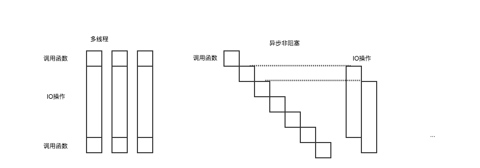

# node.js理解
node.js无疑是前端圈最热门的关键词之一，  
本文从`使用场景`、`特点`、`源码阅读`几个角度来记录一些自己对于它的理解。

## 使用场景
node的使用场景：  
适用于处理IO频繁但是CPU计算简单的场景，  
放到真正的业务场景之中作为中间层是再好不过的选择：
1. 在单页应用流行的今天可以轻松实现前后端同构，以此来提升页面渲染、加载速度，去除单页应用不利于SEO的负面影响。
2. 使用node可以对不同的后端服务进行一次全面整合，包括权限控制等很多方面。
3. js是前端程序员所最熟悉的语言之一，学习成本低但是收益高，node所实现的中间层完全可以由前端程序员完成。

## 特点
异步非阻塞是node的一大特点，  
与多线程的区别在下图中一目了然:  

- 多线程：调用函数后直接进行IO操作，把最大限度的线程或进程数执行满后，剩余的调用函数放入队列内等待，直到有线程或进程空闲出来。
- 异步非阻塞：调用函数后直接返回主线程开始执行下一个调用函数，IO操作异步执行，不占用主线程，一次类推。

通过上图可以了解到异步非阻塞的几大优势：  
1. 在特定情况下效率大大高于多线程。  
这主要取决于IO操作的开销，但是大家仔细想一想，  
进行IO操作和CPU进行简单的计算这之间效率差别有多大？  
一次IO操作的时间CPU完全可以执行上千上万次简单的计算（调用函数），  
由此可见这里的特定情况几乎可以包含所有情况。  
tips：这里的node并非真正的后端进行数据处理、操作数据库等行为，在当前的环境下node更适合作为中间层。
2. 不需要多线程所可能带来的死锁等问题。
3. 单线程的整体流程可能更易理解把控。

## 源码阅读（ 异步非阻塞的实现 ）  
node源码的阅读也是有些麻烦，  
因为不仅有js还有部分是通过cpp来编写的，  
这里主要针对http模块来解读以下异步非阻塞是如何实现的。
